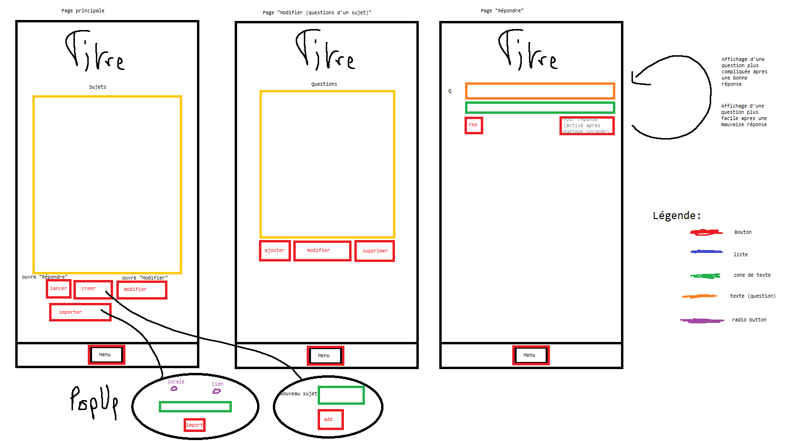

# Application de mémorisation

## A faire ?

- Jeu de question
  - [x] Ajouter / Importer
    - [x] Fichier local
    - [x] Lien HTTP
  - [x] Supprimer
  - Modifier
    - [x] Créer des questions
    - [x] Supprimer des questions
  - [x] Choisir / Sélection
  - [x] Commencer un jeu
  - [ ] Reprendre la progression d'un jeu
  - [ ] Afficher les statistiques de tous les jeux
- Dans un jeu
  - [x] Consulter la réponse à une question trop difficile
  - [ ] Choisir le statut d'une question
  - [x] Modifier la question
  - [x] Supprimer la question
  - [ ] Afficher les statistiques du jeu de question en cours
- [ ] Notification
  - une fois par jour
- [ ] Paramètres
  - [ ] Temps de réponse aux questions
  - [ ] Thème
  - [ ] Taille police
- Extensions
  - [ ] Images
  - [ ] Sons

## Requis

- Jetpack Compose (interface)
  - ViewModel
- Room (base de donnée)

## C'est mieux s'il y a

- Coroutines
- Datastore
- Material3
- Adaptation à l'écran
- Menus
- Navigation
- Services
- Alarmes
- Notification
- Download manager
- Rotation d'écran

## Critères autres

- Architecture
- Modularité
- Clarté du code
- Bonne conception de la base de donnée
- Ergonomie et facile d'utilisation
- Graphisme _ne compte pas trop pour la note finale_

## Interface -- Draft

